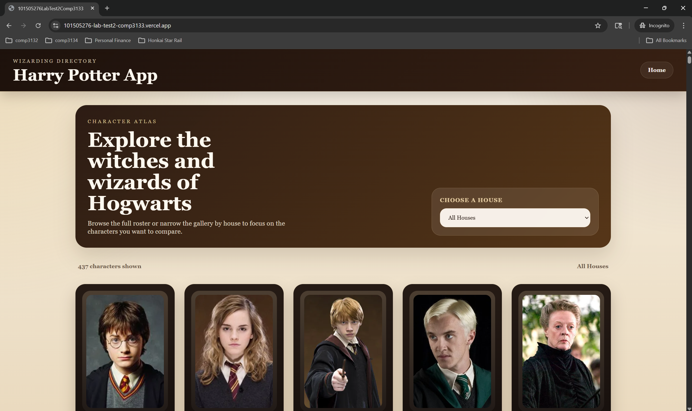
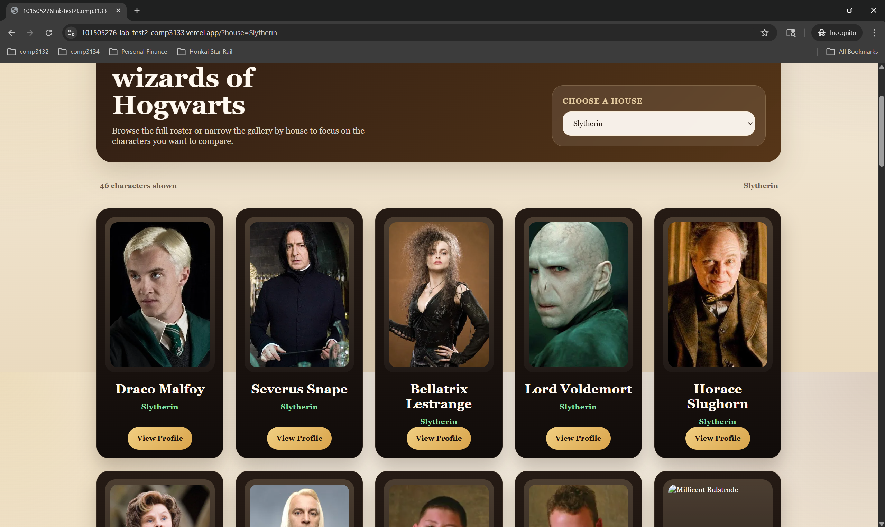
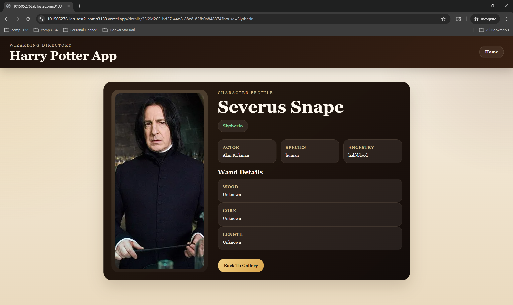

# Harry Potter Character Explorer

## App Description

Harry Potter Character Explorer is an Angular 21 web application that displays characters from the Harry Potter universe using the HP API. Users can browse the full character gallery, filter characters by Hogwarts house, open a detailed profile for each character, and return to the filtered gallery view without losing context.

The app was designed with a more polished fantasy-inspired interface, combining a warm parchment background, cinematic cards, and a cleaner profile layout for a more engaging browsing experience.

## Features Implemented

- Display a gallery of Harry Potter characters fetched from the HP API
- Filter characters by house: Gryffindor, Slytherin, Hufflepuff, and Ravenclaw
- Open a details page for an individual character
- Preserve the selected house filter in the URL using query parameters
- Support direct navigation to character details using route parameters
- Return from the details page back to the main gallery
- Responsive layout for desktop and mobile screens
- Updated visual design for the navigation bar, gallery cards, and details page
- Vercel-ready configuration for deployment

## Screenshots of the Application

### 1. Home Page - Character Gallery

Description:
This screen shows the main landing page of the application. It includes the navigation bar, the hero section, the house filter dropdown, and the responsive grid of character cards.

Suggested screenshot file:
`docs/screenshots/home-gallery.png`

### 2. Filtered View - House Selection

Description:
This screen shows the gallery after selecting a Hogwarts house from the dropdown. The URL updates with the selected house query parameter, and only matching characters are displayed.

Suggested screenshot file:
`docs/screenshots/house-filter.png`

### 3. Character Details Page

Description:
This screen shows the detailed profile of a selected character, including the house, actor, species, ancestry, and wand details, along with the button to return to the gallery.

Suggested screenshot file:




Note:
Actual screenshot image files were not generated automatically in this environment because no local frame-extraction tool was available for the provided screen recording. If required for submission, export a few PNG screenshots from the running app and place them in the `docs/screenshots/` folder using the filenames above.

## Instructions to Run the Project

### 1. Install dependencies

```bash
npm install
```

### 2. Run the development server

```bash
npm start
```

### 3. Open the application

Open your browser and go to:

```bash
http://localhost:4200/
```

## Additional Useful Commands

### Build the project

```bash
npm run build
```

### Run tests

```bash
npm test
```

## Technologies Used

- Angular 21
- TypeScript
- Angular Router
- Angular SSR
- HTML and CSS
- HP API: `https://hp-api.onrender.com/api`
